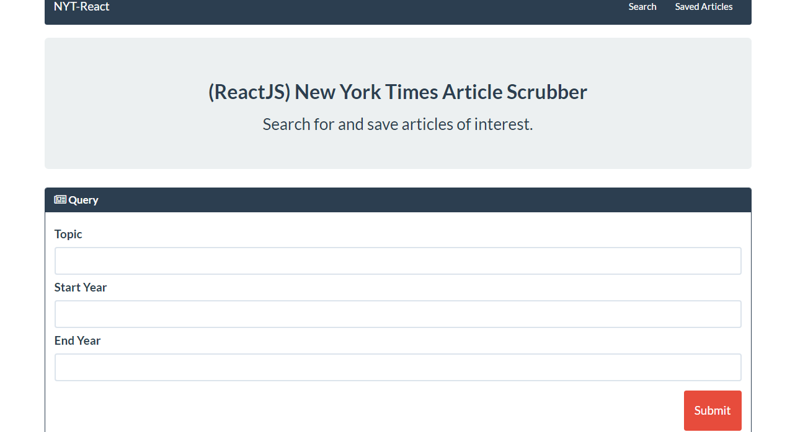

# react-article
New York Articles - using MongoDB, Express.js, React.js, and Node.js( MERN) 

use command 'webpack -w' for updating

### How to install:

- Clone or fork this repo
- Run `npm install`
- use command 'webpack -w' if you have updated anything in HTML/CSS.

### How to run: 

- run 'npm start'
- Open a demo page at http://localhost:3000
